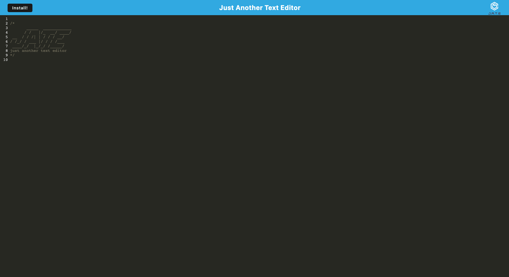

# Just Another Text Editor

## Description
JATE is a PWA text editor which utilizes local storage and an IndexedDB database to store the users most recent edits to their text file.

## Instructions
Open the app and edit away! Progress is saved to the database when the user clicks away from the text editor window.

## Application
[Deployed App](link)

